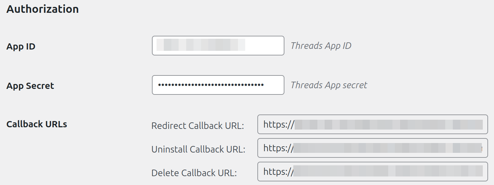
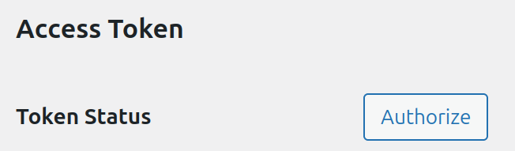
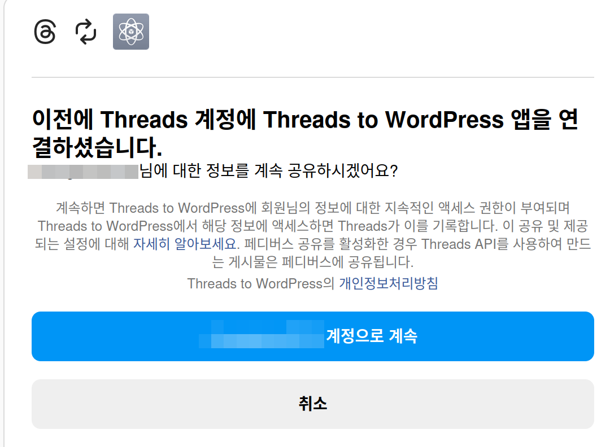
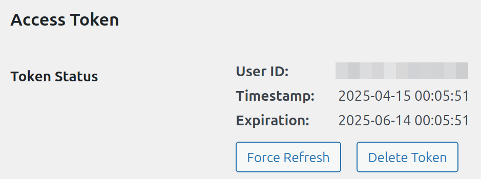

# Threads To Post 플러그인

스레드에 포스팅된 내 글을 워드프레스로 가져옵니다.

## 설치 안내

**일러두기**: 이 플러그인은 정식으로 wordpress.org 에 등록된 플러그인이 아닙니다. PHP를 커맨드라인으로 실행할 수 있고,
composer PHP 패키지 관리자가 설치되어 있어야 합니다.

**PHP 8.0 이상에서 동작합니다.**

플러그인을 git clone 으로 복제합니다.

```bash
git clone https://github.com/chwnam/threads-to-posts.git
```

플러그인을 디렉토리째 워드프레스의 `wp-content/plugins/` 아래로 옮긴 후 플러그인 루트로 이동합니다.
필요한 의존성 패키지를 설치합니다.

```bash
cd /path/to/wordpress/wp-content/plugins/threads-to-posts
composer install
composer dump-autoload -a
```

워드프레스에 로그인 한 후, 관리자 페이지로 가서 플러그인을 활성화합니다.
그러면 관리자 > 도구 메뉴에서 'Threads to Posts'를 발견할 수 있을 것입니다.

## 설정 안내

스레드 API를 정상적으로 사용하려면 메타 개발자 사이트에서 앱을 등록해야 합니다.
이와 관련된 설정은 [설정 문서](./doc/how-to-setup.md)를 참고하기 바랍니다.

## 액세스 토큰 발급

설정을 정상적으로 마치면 발급받은 'App ID'와 'App Secret'을 이용해 액세스 토큰을 발급받을 수 있습니다.
이것을 `도구 > Threads to Posts > Settings`에서 입력합니다. 아래 그림과 같습니다.


먼저 '저장' 버튼을 누릅니다. 그러면 'Access Token' 섹션에 'Authorize' 버튼이 생성됩니다.
버튼을 누릅니다.


그러면 스레드 웹 사이트에서 아래와 비슷한 인증을 위한 메시지가 출력됩니다.
메시지는 상태에 따라 조금 다를 수 있습니다.
스레드 (https://www.threads.net) URL이 정확하다는 것을 확인하세요.


승인하면 아래 그림처럼 액세스 토큰 상태를 확인할 수 있습니다.


## 글 수집하기

우선 스레드 API를 사용하기 위한 설정이 완료되어야 합니다.
액세스 토큰의 상태를 정상적으로 확인할 수 있다면 커맨드라인을 이용해 `wp ttp` 명령을 사용해
글 수집을 진행할 수 있습니다.

먼저 아래 명령어를 이용해 스크랩을 준비시킬 수 있습니다

```bash
wp ttp scrap
# Queue will be cleared. Are you sure? [y/n] 
```

여기서 'y'를 누르면 준비가 완료됩니다.

그리고 아래 명령어를 이용해 스크랩을 진행합니다.

```bash
wp ttp run
```

한번에 25개의 작업이 진행되며, 작업이 끝난 후 작업 큐에 작업이 남아있는지 확인합니다.
아래 명령을 사용해 큐를 확인합니다.

```bash
wp ttp status
```

큐에 작업이 빌 때 까지 `wp ttp run` 명령을 입력합니다. 한번에 많이 작업하고 싶다면,
아래처럼 최대 진행 작업 수를 늘릴 수 있습니다.

```bash
wp ttp run --max_task=100
```

## 버전 변경 기록

[CHANGELOG.md](./CHANGELOG.md) 문서를 참조하세요.
