# 셋업 방법

## 용어

- Threds: [threads](https://www.threads.net) 서비스를 의미합니다. 항상 영문으로 적습니다.
- 스레드: Threads에서 삭성된 포스팅을 스레드라고 합니다.
- 포스트: 워드프레스로 가져온 스레드를 말합니다.

## 메타 개발자 계정 생성

[메타 개발자 사이트](https://developers.facebook.com/)에 접속하여 계정을 생성합니다.
기존 페이스북, 인스타그램, Threads 계정이 있다면 해당 계정 정보로 로그인 가능할 것입니다.

## 앱 만들기

이 플러그인은 별도의 자동 설정을 지원하지 않습니다. 앱을 직접 생성하고 셋업해야 합니다.
앱을 생성하지 않았다면 먼저 앱을 만들어야 합니다. 이 작업은 한 번만 제대로 완료하면 됩니다.

앱을 생성하는 방법을 여기서 설명합니다.
우선, '[내 앱](https://developers.facebook.com/apps/)' 페이지로 이동합니다.
'앱 만들기' 버튼을 눌러 앱을 생성합니다.
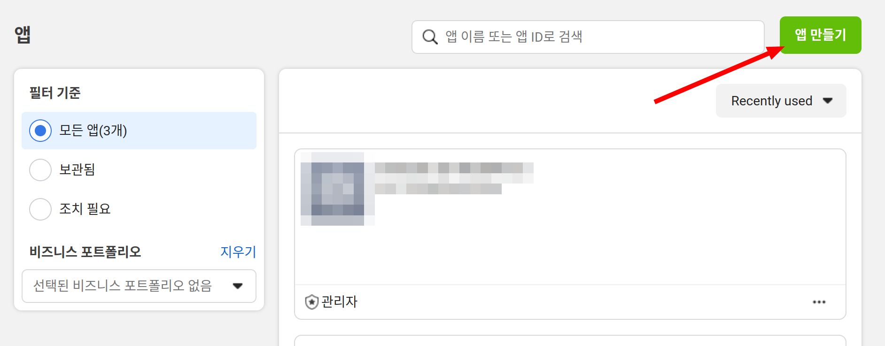

앱의 이름과 연락처 이메일을 입력하고 다음으로 넘어갑니다.
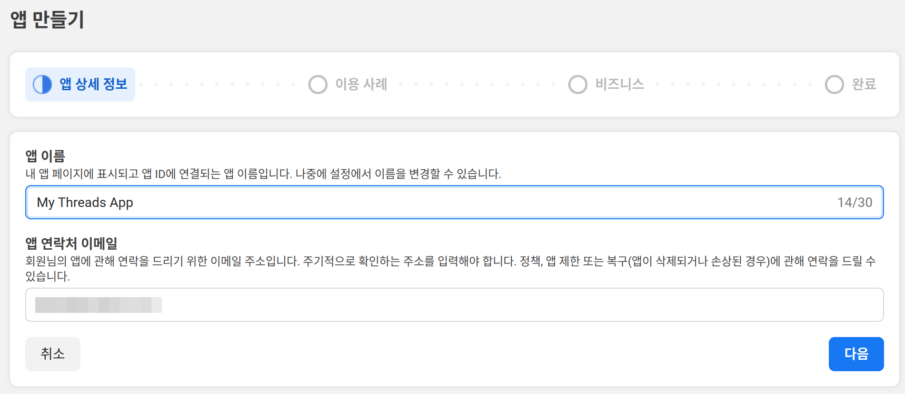

'이용 사레 추가' 항목에서는 'Threads API 액세스'를 선택합니다. 다른 항목은 필요하지 않습니다.
다음을 눌러 계속합니다.
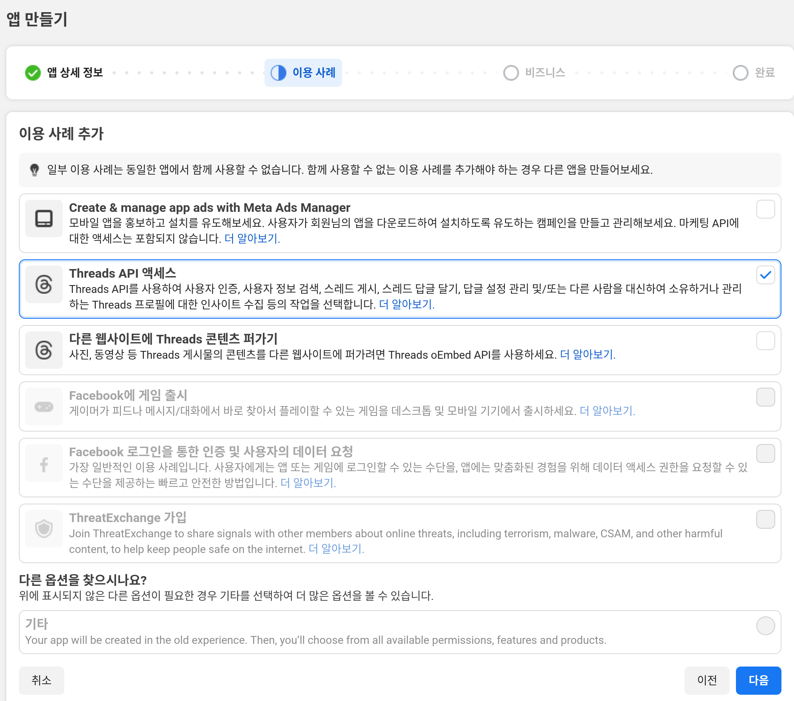

비즈니스 포트폴리오를 연결하지 않으므로, '아직 비즈니스 포트폴리오를 연결하고 싶지 않음.'을 클릭하고 다음으로 넘어갑니다.
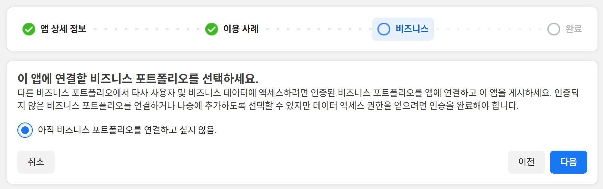

앱 생성이 완료되었습니다. '대시보드로 이동' 버튼을 눌러 이동합니다.
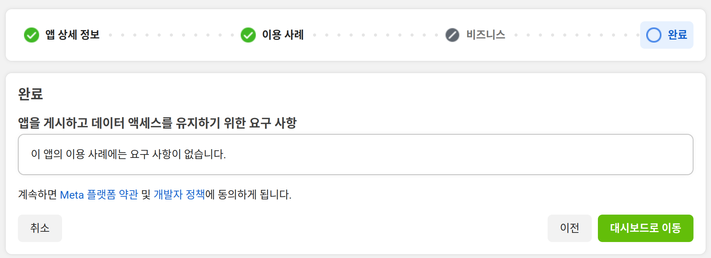

## Threads API 설정

이제 만든 앱의 대시보드로 이동하여 앱을 설정하는 방법에 대해 설명합니다.
[내 앱](https://developers.facebook.com/apps) 페이지에서 생성한 앱을 선택합니다.
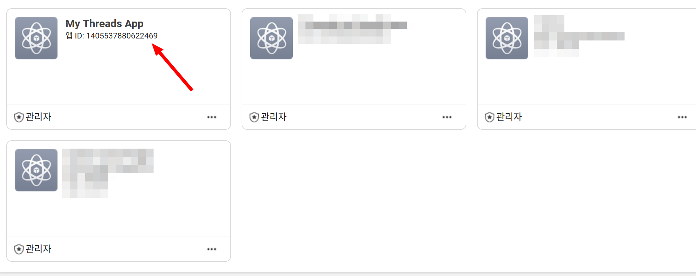

앱 대시보드로 진입하면, 좌측 메뉴에서 '이용사례'를 클릭합니다.
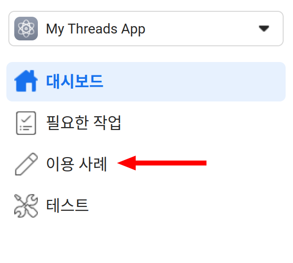

이용사례에서 'Threads API 엑세스'가 보일 것입니다. '맞춤설정'을 클릭하여 진행합니다.
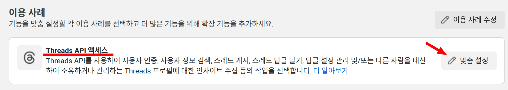

여기서 이 앱이 Threads를 상대로 사용할 수 있는 동작을 지정합니다.
이 플러그인은 댓글을 읽기 위해서는 'threads_read_replies' 권한을 추가로 필요합니다.
화면을 아래로 내려 해당 권한을 찾은 후 '추가' 버튼을 눌러 진행합니다.
추가가 잘 되었다면 '테스트 준비 완료'라는 글씨가 보일 것입니다.
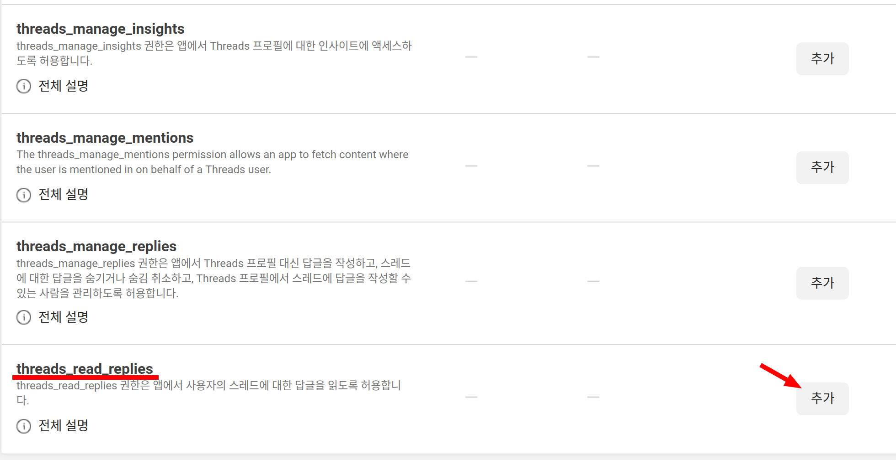
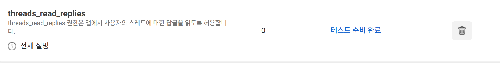

다음 화면 좌측에서 'Thread API 액세스 > 설정' 메뉴를 클릭해 이동합니다.
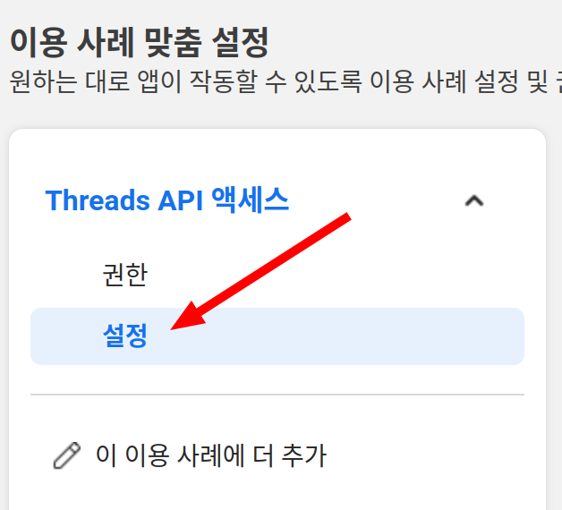

아래는 여기서 주의해서 설정해 주어야 할 사항들입니다.
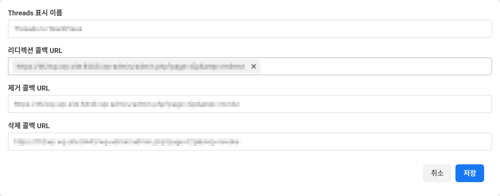

1. Thread 앱 ID: 잘 복사해 기록해 두시기 바랍니다. 이 플러그인 설정에서 요구합니다.
2. Thread 앱 시크릿 코드: 마찬가지로 플러그인의 설정에서 요구합니다.
3. 리다이렉션 콜백 URL: 플러그인 설정에서 지시한 URL을 붙여 넣으세요.
4. 제거 콜백 URL: 플러그인 설정에서 지시한 URL을 붙여 넣으세요.
5. 삭제 콜백 URL: 플러그인 설정에서 지시한 URL을 붙여 넣으세요.

다음 화면 아래 '사용자 토큰 생성기'에서  Threads의 본인 계정을 찾아 추가해야 합니다.
'Threads 테스터 추가 또는 삭제' 버튼을 누릅니다. 
이 버튼을 누르면 '앱 역할' 메뉴로 이동합니다.
좌측 메뉴에서 이 메뉴를 직접 찾아 이동해도 됩니다.  
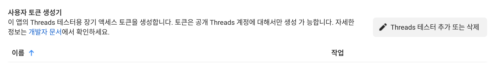

'사람 추가' 버튼을 누릅니다.
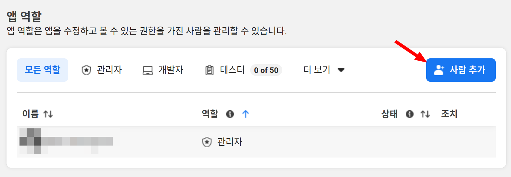

아래 그림처럼 'Threads 테스터'를 선택하고, 나타나는 텍스트 상자에서 자신의 스레드 아이디를 검색합니다.
설정이 완성되었으면 '추가' 버튼을 눌러 다음으로 진행합니다.
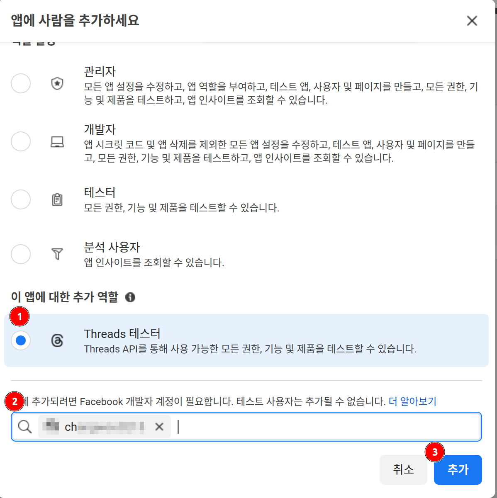

아래 그림처럼 자신의 계정이 올바르게 추가되고 '대기중'인지 확인합니다.
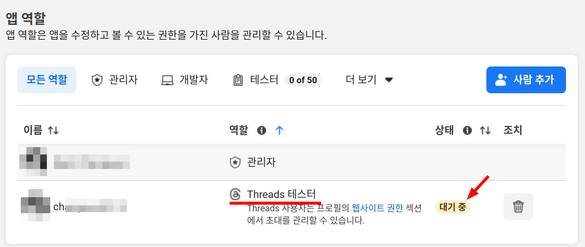

## 계정 초대

Threads 테스터로 초대 되었다면 Threads 설정에서 해당 초대를 확인할 수 있습니다.
Threads 의 설정으로 이동합니다. 메뉴 중 아래 그림과 같은 아이콘을 클랙합니다.
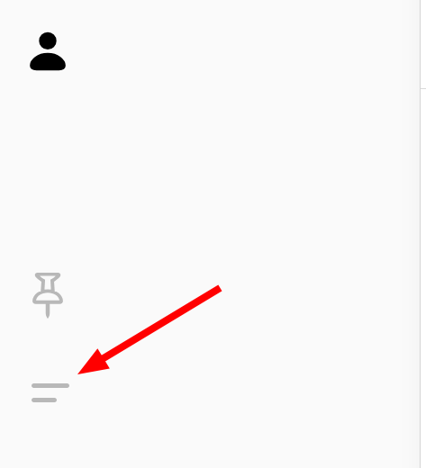

펼쳐지는 메뉴에서 '설정'을 클릭하면 설정 페이지로 이동할 수 있습니다.
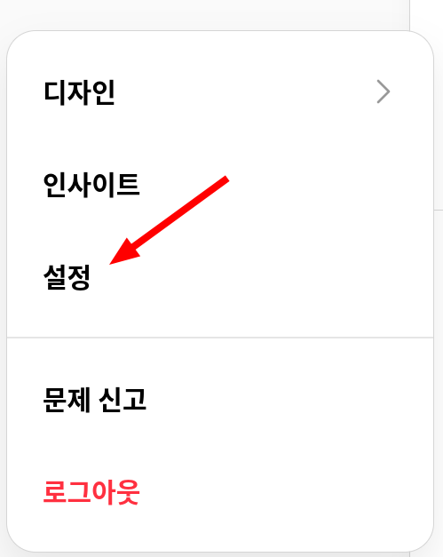

'계정' 탭에서 '웹사이트 권한'을 선택합니다.
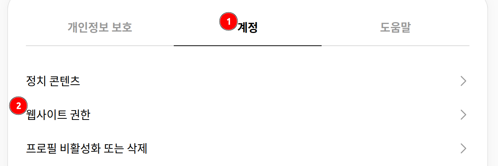

이어 나오는 메뉴에서 '초대'를 선택하면 아래 그림처럼 초대가 와 있을 것입니다.
여기서 (2)의 앱 이름을 확인한 후, '수락' 버튼을 누릅니다.
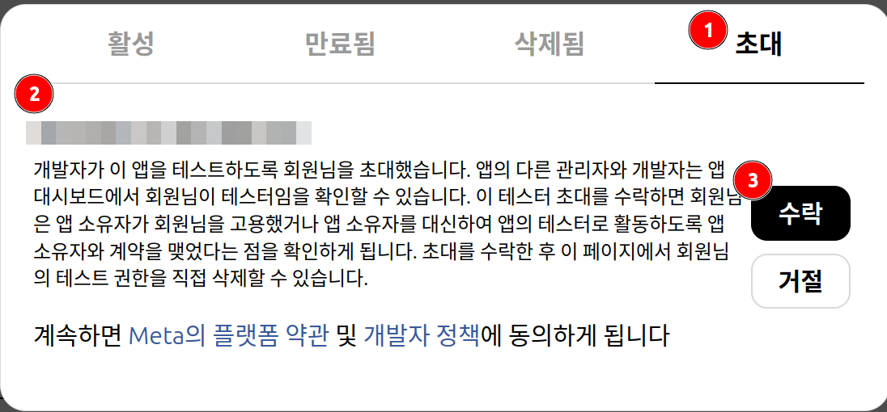

여기까지 진행되었다면 플러그인에서 스레드에 접근할 수 있는 모든 준비가 끝났습니다.
